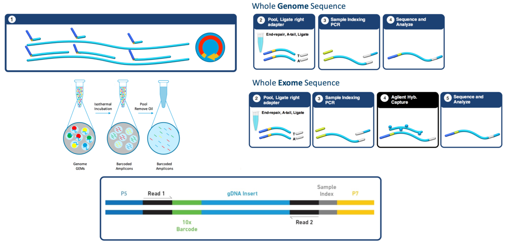
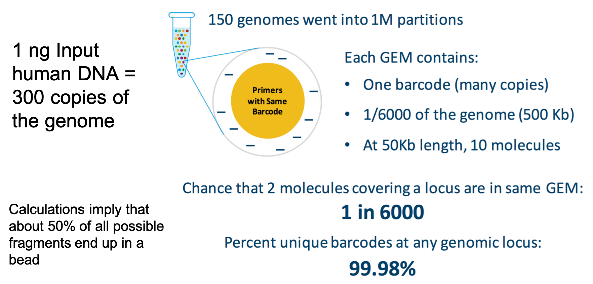
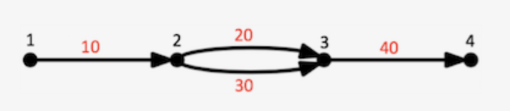
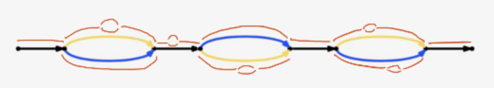
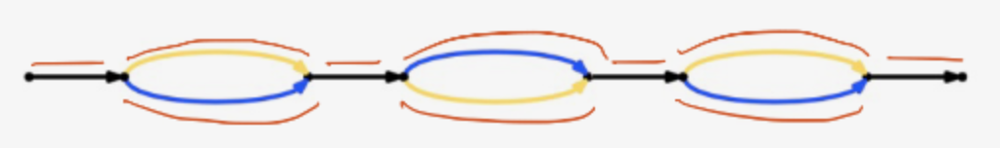
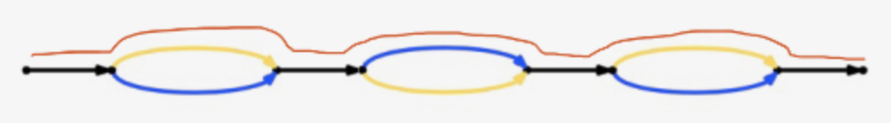
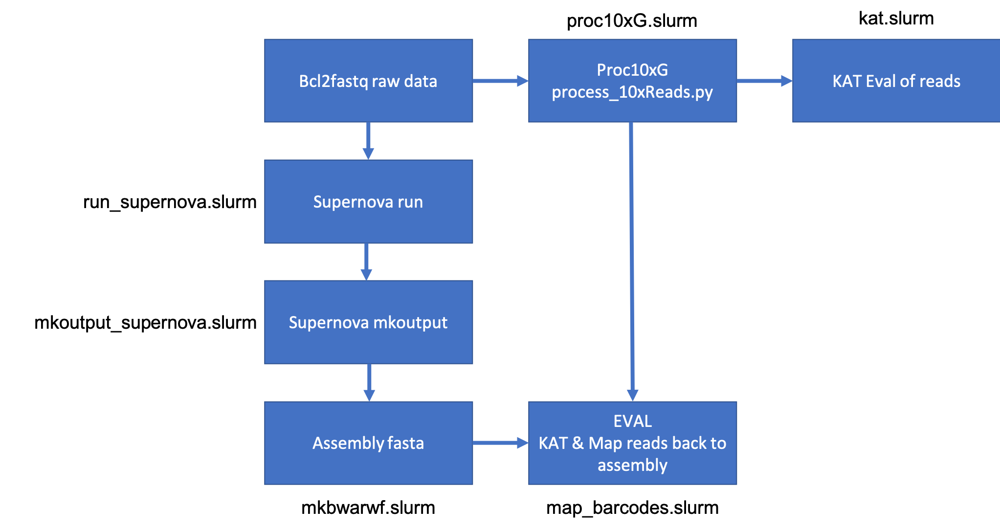

### 10X genomics data and assembly with Supernova

## 10X Platform

***Linked Reads***

***Laboratory Protocol***

***The Math***

## 10X assembly with supernova

[https://support.10xgenomics.com/de-novo-assembly/software/overview/latest/welcome](10X Genomics Supernova main page)

Supernova's [__"achieving success"__](https://support.10xgenomics.com/de-novo-assembly/software/overview/latest/welcome)

***Benefits***

  * End-to-end solution - extract DNA, prepare, generate, sequence, run supernova (only one parameter).
  * Requires only a small amount of DNA (1 ng)
  * Cost effective - can do 3Gb genome for ~$2500
  * Can produce a high-quality representation.

***Range***

  * Genome Size: 140Mb - 3.2Gb
  * Genome Ploidy: diploid, they think haploid is ok, polyploid????

***Guidance***

  * Start from a single individual
  * Long undamaged DNA, DNA < 20Kb don't bother, DNA < 50Kb no promises
  * Sequence 2x150 (on Illumina Novaseq, X, or HiSeq 2500 rapid mode, *NOT HiSeq 4000*)
  * Sequence depth > 56X coverage, estimate haploid genome size * 56 * 300 = read pairs needed. Can sequence more, but too much is also detrimental.
  * Min computational requirement are 16-core, 256Gb machine, may require 512Gb machine, I have yet seen the need to go to 1Tb [YET]. At least 0.5Tb of free space available.

***Annoyance***

  * Max reads allowed into supernova is 2^31-1 ~ 2 Billion single reads, which means max genome size of ~5.75Gb @ 56X target coverage.

**Downloading Supernova**

[download location](https://support.10xgenomics.com/de-novo-assembly/software/downloads/latest)

Installing is basically extract and test. I've personally never had an issue, but would seem few have.

**Supernova has 3 - sub applications**

   * supernova mkfastq - totally unnecessary
   * supernova run - produces the assembly graph
   * supernova mkoutput - produces fasta files of assemblies

**Fastq files**

Have your sequencing provider produce fastq files as you would any other sequencing project. No need to start with bcl files and run supernova mkfastq.

Barcodes - 10X genomics libraries have barcodes, which is a good thing, means we can sequence multiple libraries on a single run, __very important now that we can use the Novaseq__, further they were aware of barcode issues and have 4 barcodes for every library.

Instructions can be found [here](https://support.10xgenomics.com/de-novo-assembly/software/pipelines/latest/using/bcl2fastq-direct)

Sample index sets can be found [here](https://support.10xgenomics.com/de-novo-assembly/sequencing/doc/specifications-sample-index-sets-for-genome-and-exome)

__However__ you want to make sure your sequencing provider does not demuliplex out each barcode, you should get 1 set of fastq files, which contained within are data from 4 barcodes. They should know how to do this.

**Outputs**

Output of supernova run:

- Run summary:  sample/outs/summary.csv
- Run report:   sample/outs/report.txt
- Raw assembly files: sample/outs/assembly

A report.txt

  --------------------------------------------------------------------------------
  SUMMARY
  --------------------------------------------------------------------------------
  - Sun Nov 11 22:16:07 2018
  - [aspidoscelis_lizard_supernova]
  - software release = 2.1.1(6bb16452a)
  - likely sequencers = NovaSeq
  - assembly checksum = -5,063,456,451,775,227,443
  --------------------------------------------------------------------------------
  INPUT
  -  762.40 M  = READS                 = number of reads; ideal 800M-1200M for human
  -  139.50  b = MEAN READ LEN         = mean read length after trimming; ideal 140
  -   63.93  x = RAW COV               = raw coverage; ideal ~56
  -   44.12  x = EFFECTIVE COV         = effective read coverage; ideal ~42 for raw 56x
  -   89.67  % = READ TWO Q30          = fraction of Q30 bases in read 2; ideal 75-85
  -  346.00  b = MEDIAN INSERT         = median insert size; ideal 350-400
  -   92.17  % = PROPER PAIRS          = fraction of proper read pairs; ideal >= 75
  -    1.00    = BARCODE FRACTION      = fraction of barcodes used; between 0 and 1
  -    1.80 Gb = EST GENOME SIZE       = estimated genome size
  -    6.90  % = REPETITIVE FRAC       = genome repetitivity index
  -    0.03  % = HIGH AT FRACTION      = high AT index
  -   42.95  % = ASSEMBLY GC CONTENT   = GC content of assembly
  -    0.07  % = DINUCLEOTIDE FRACTION = dinucleotide content
  -  167.51 Kb = MOLECULE LEN          = weighted mean molecule size; ideal 50-100
  -  367.76    = P10                   = molecule count extending 10 kb on both sides
  -  292.00  b = HETDIST               = mean distance between heterozygous SNPs
  -    6.64  % = UNBAR                 = fraction of reads that are not barcoded
  -  614.00    = BARCODE N50           = N50 reads per barcode
  -   20.97  % = DUPS                  = fraction of reads that are duplicates
  -   57.46  % = PHASED                = non-duplicate and phased reads; ideal 45-50
  --------------------------------------------------------------------------------
  OUTPUT
  -    3.32 K  = LONG SCAFFOLDS        = number of scaffolds >= 10 kb
  -   15.29 Kb = EDGE N50              = N50 edge size
  -   35.16 Kb = CONTIG N50            = N50 contig size
  -   14.17 Mb = PHASEBLOCK N50        = N50 phase block size
  -   50.38 Mb = SCAFFOLD N50          = N50 scaffold size
  -    5.67  % = MISSING 10KB          = % of base assembly missing from scaffolds >= 10 kb
  -    1.55 Gb = ASSEMBLY SIZE         = assembly size (only scaffolds >= 10 kb)
  --------------------------------------------------------------------------------
  ALARMS
  --------------------------------------------------------------------------------

**Supernova mkoutput**

mkoutput sub-application is what traverses the graph produced by supernova run and outputs fasta files that represent your "assembly".

Graph can be represented like

Each edge represents a DNA sequence (here represented by 10,20,30,40), and successive edges overlap each other by a kmer junction (K-1 bases, currently K=48). So concatenating successive edges requires deleting the shared k-1 bases at each junction. Each edge has left and right vertices. For example, edge 10 has left vertex 1 and right vertex 2. Any path through a Supernova graph is a list of edges, for example 10,20,40 is a path in the above graph that extends vertices 1 .. 4.

  >1 edges=56793,1700916,733979,1039876,471726,2775518,688836,1700914,693338 left=118468 right=118473 ver=1.10 style=4

There are four modes of output

raw - extract all edges

megabubbles - extract all megabubbles

Here Bubbles are flattened by selecting the branch having highest coverage. Gaps are joined to adjacent sequences, resulting in longer edges that represent the gaps internally by sequences of Ns. Reverse complement edges are not represented.

pseudohap - extract the single pseudohaplotype

pseudohap2 - extract the both pseudohaplotypes

Little point in ever using pseudohap, but rather pseudohap2 as first haplotype product is the same in both and you get both with pseudohap2.

**Supernova pipeline Structure**

   The log file output by supernova will tell you approximately where you are in the [pipeline](https://support.10xgenomics.com/de-novo-assembly/software/pipelines/latest/map/sn-assembly) and how much more you have to go.

## proc10xG python scripts

A small set of python scripts to process linked reads. [github page](https://github.com/ucdavis-bioinformatics/proc10xG)

**Scripts ready for use**

On Fastq Files
  * process_10xReads.py - process fastq files generated from bcl2fastq, longranger mkfastq, or supernova mkfastq
  * filter_10xReads.py - Filters 10x fastq file (processed with process_10xReads.py) by barcode status and/or barcode reads depth or barcode list. (Plan to also support sam/bam input/output)
  * regen_10xReads.py - Returns reads to fastq file (processed with process_10xReads.py) to 'original' for suitable for input into longranger or supernova (eg after filtering). (Plan to also support sam input)

On BWA Mapped Sam/Bam files
* samConcat2Tag.py - extract the FASTA/FASTQ comment appended to SAM output from bwa mem -C and generates 10x genomics sam tags

Example

  1. first process reads with process_10xReads.py which extracts the GEM barcode and primer sequence and compares
   the barcode to a white list, marking reads with status. Then appends the status, library barcode, GEM barcode,
   primer sequences and corresponding quality scores to the comment of the read ID and the whitelisted barcode to
   the beginning of the read, in interleaved format
  1. Then map to the genome using bwa mem with flags -p (interleaved) and -C (appends comment to the sam file)
  1. Next process with samContcat2Tag.py which extracts the appended comment and add tags
  1. sort using samtools sort, sorting on reads ID (GEM Barcode)
  1. and finally saving log output to stderr.out and stdout.out

    process_10xReads.py -a -1 data/CaCon-sm_R1_001.fastq.gz
    -2 data/CaCon-sm_R2_001.fastq.gz |
    bwa mem -t 1 -p -C data/polished_p_ctg.fa - | samConcat2Tag.py | samtools sort -n -o mapping.bcmapped.bam - 2> stderr.out > stdout.out

# Hands on - assembling a Lizard Genome

**Workflow**

Data location - /share/workshop/msettles/aspidoscelis_assembly

**Tasks**
1. Create folder in your workshop directory
1. Link raw data into your directory
  * /share/workshop/msettles/aspidoscelis_assembly/2018_Sept_10X
1. Link slurm scripts to your directory
1. Create a slurm_out directory
1. Clone the proc10xG repo
  * git clone https://github.com/ucdavis-bioinformatics/proc10xG.git

With small modification to the script, everything now should be set up for you to run all the scripts and create a 10x Assembly using Supernova.

**Your Chores**
