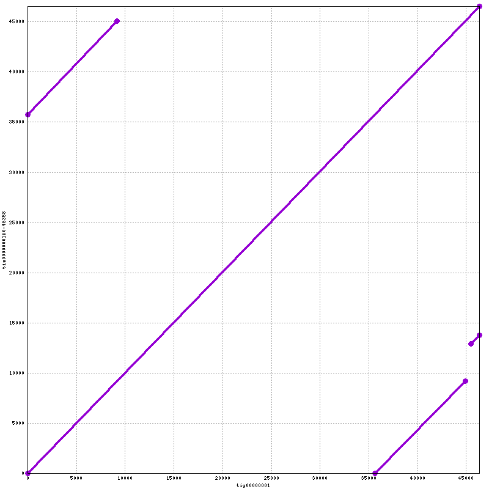

Assembly using Oxford Nanopore sequencing data
===============================================

**1\.** Let's get the toy data and set up some directories for the analysis.

First, we are going to get into your own directory and create sub-directories for the raw data, qc, and analysis.

    cd /share/workshop/(your user name)

    mkdir Nanopore
    cd Nanopore

    mkdir 00-RawData 02-QCData 02-Cleaned 03-Canu-Lambda 03-Miniasm-Lambda 04-Nanopolish-Lambda 04-Mummer-Lambda

Then, let's get the raw data. We are going to create a soft link to the data in my directory. This way, we can save both disk space and time.

    ln -s /share/biocore/projects/Internal_Jessie_UCD/Nanopore/00-RawData/lambda 00-RawData/

---

**2\.** First step in an assembly, it's best to look at the raw data and know what quality of data one has in hand. The information one gets from looking at the raw data will help to make decision on the parameters in downstream analysis, or whether more data/better data should be generated. Fortunately, there is a very nice tool that one can use - NanoPlot ([link to github](https://github.com/wdecoster/NanoPlot)). NanoPlot can take fastq files as input, or the sequencing_summary.txt file.

    cd 02-QCData
    cp /share/workshop/jli/Nanopore/02-QCData/run_nanoplot.sh .

This script will submit a job to run nanopolish on the lambda we have. The command to submit this script is as following. Please replace "nnp.jli" with the name for your own job. The same applies to all the rest of the documentation, whenever we submit a job, please replace "jli" to your own user name.

    sbatch -J nnp.jli run_nanoplot.sh lambda ../00-RawData/lambda

After the job has been executed successfully, you should have a file named "lambdaNanoPlot-report.html" in your 02-QCData directory. It should look similar to the one I have generated [link](lambdaNanoPlot-report.html). This report will help us to decide whether we should filter our data next and what length of reads we want to keep and what should be the base quality of the reads.

---

**3\.** The second step in an assembly, is to remove any adpters from the reads. For Nanopore data, we use porechop.

    cd ../02-Cleaned
    cp /share/workshop/jli/Nanopore/02-Cleaned/run_porechop.sh .
    sbatch -J pcp.jli run_porechop.sh

---

**4\.** The next step is to filter the raw sequencing reads. From the NanoPlot report, we are going to remove reads that are shorter than 3000bp and have a mean base quality less than 10. In choosing these two cutoff values, one should also keep in mind the size of the genome and a desired minimum coverage. We are going to use a package called Filtlong to accomplish this task. Filtlong was designed to filter long noisy sequencing data.

    cp /share/workshop/jli/Nanopore/02-Cleaned/run_filtlong.sh .
    sbatch -J ftl.jli run_filtlong.sh

After the above two steps of quality control, one may want to check the quality of the filtered data again. You can run NanoPlot on the filtered data. I will leave that to you as an exercise.

---

**5\.** Now that the raw sequencing data has gone through all the quality control, we can start the assembly. There are many assembly packages designed for long noisy sequencing data. I am going to go through two of them: canu and miniasm. We are going to use canu first. It is a tool that error correct the raw sequencing reads first, to create high accuracy data for down stream assembly. In running canu, there are two main parameters we can set that will affect the assembly quite a lot. One is the minimum length of reads that will be used in the assembly (minReadLength). The other is the minimum overlap length that will be saved (minOverlapLength).

    cd ../03-Canu-Lambda
    cp /share/workshop/jli/Nanopore/03-Canu-Lambda/run_canu.sh .

In order to run the following command, please change the last argument "jli" to your user name, which will tell the script to run everything in your directory.

    sbatch -J canu.jli run_canu.sh jli

Because of the error correction step, canu runs much slower than other packages that do not include the error correction step.

---

**6\.** Miniasm is a package created by Heng Li. It runs extremely fasta. However, the base quality in the assembly is the same as the base quality in the raw sequencing data.

    cd ../03-Miniasm-Lambda
    cp /share/workshop/jli/Nanopore/03-Miniasm-Lambda/run_miniasm.sh .

In order to run the following command, please change the last argument "jli" to your user name, which will tell the script to run everything in your directory.

    sbatch -J mini.jli run_miniasm.sh jli

---

**7\.** After generating the draft assembly, the next step is to polish it. Nanopolish is a tool that polish an assembly uses the raw signal data in its original fast5 format. We are going to use Nanopolish on the assembly generated by miniasm. The process is run in the mode that is methylation aware.

    cd ../04-Nanopolish-Lambda
    cp /share/workshop/jli/Nanopore/04-Nanopolish-Lambda/run_nanopolish.sh .

In order to run the following command, please change the last argument "jli" to your user name, which will tell the script to run everything in your directory.

    sbatch -J nnp.jli run_nanopolish.sh jli

This step includes several processes: mapping of the sequencing reads to the draft assembly, indexing all relevant files, and finally run nanopolish. Because nanopolish uses the raw current data in the sequencing, it takes some time to finish. The polishing step may be run iteratively until consensus quality converge.

---

**8\.** Now that we have two draft assemblies and one polished assembly, we can align one to another to see the difference between assembly packages, or the effect of the polishing process.

    cd ../04-Mummer-Lambda
    cp /share/workshop/jli/Nanopore/04-Mummer-Lambda/run_nucmer.sh .

In order to run the following command, please change the last argument "jli" to your user name, which will tell the script to run everything in your directory.

    sbatch -J nuc.jli run_nucmer.sh jli

When the job finishes, we should have a file named "lambda.draft.png" in the working directory. We can download it to our laptop for viewing. This script aligns the draft assembly from miniasm to the draft assembly from canu. The assembly from canu is on the x axis. You can modify the script to generate the alignment of the polished assembly to the draft assembly from miniasm. The one I generated is .

We can also generate similar plot between the assemblies and the reference genome. Please get a copy of the reference genome using the following command. Then you should be able to use the above script (with modification) to accomplish the goal.

    ln -s /share/biocore/projects/Internal_Jessie_UCD/Nanopore/References/lambda_ref.fasta .

